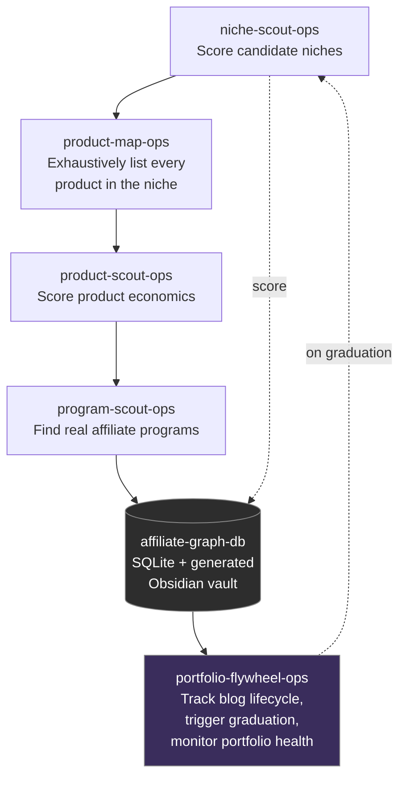

# Affiliate Content Flywheel — Multi-Agent Research & Orchestration System

A six-component agent skill system that researches, scores, and tracks a portfolio
of niche affiliate content sites end to end — from candidate niche selection through
product economics scoring, real affiliate program discovery, persistent graph storage,
and portfolio-wide lifecycle orchestration. Built to run against a live production
site (a Hugo-based affiliate blog) and designed to be framework-agnostic: each
component is a plain-text specification plus standard-library Python, portable across
Claude, OpenClaw, or any other agent runtime.

## Why this exists

Most single-site affiliate automation stops at "generate an article." This system
treats content generation as the *last* step in a pipeline, not the only one — the
harder and more valuable problems are upstream: is this niche actually viable, which
specific products in it are worth promoting, where do you actually get paid to
promote them, and how do you know a site is doing well enough to justify building
the next one. Each of those is a separate, composable component here rather than one
monolithic script.

## Architecture



**Research layer** (independent, composable): `niche-scout-ops`, `product-map-ops`,
`product-scout-ops`, `program-scout-ops` — each a weighted scoring rubric or
enumeration methodology, usable standalone or chained.

**Persistence layer**: `affiliate-graph-db` — a relational SQLite schema (niches,
products, programs, and their many-to-many relationships) that every research
component writes to, plus a generator that produces a fully cross-linked Obsidian
vault from the database on demand. The vault is treated as disposable, regenerable
output; the database is the actual source of truth.

**Orchestration layer**: `portfolio-flywheel-ops` — tracks each site's lifecycle
(candidate → building → active → graduated), detects a graduation trigger (first
confirmed sale or an article-count threshold), and runs centralized health checks
across every site in the portfolio to catch silent failures automatically.

Each component is implemented as a Claude Agent Skill (a `SKILL.md` spec plus
optional bundled scripts/references), a format chosen specifically for portability —
the same skill definitions work whether the executing agent is Claude, an
OpenClaw-based Spike/Hermes setup, or another framework entirely, since the
underlying scripts are plain Python + SQLite with no framework-specific dependencies.

## Repository structure

```
niche-scout-ops/          Weighted rubric for scoring candidate niches
product-map-ops/          Methodology for exhaustive product enumeration within a niche
product-scout-ops/        Weighted rubric for scoring product commission economics
program-scout-ops/        Affiliate program discovery, major networks + direct programs
affiliate-graph-db/       SQLite schema + Obsidian vault generator (persistence layer)
portfolio-flywheel-ops/   Blog lifecycle tracking, graduation triggers, health monitoring
docs/example-output.md    Real, tested output from an end-to-end run (see below)
```

## Tested, not just designed

Every script in `affiliate-graph-db/scripts/` and `portfolio-flywheel-ops/scripts/`
was run end-to-end against sample data before being considered done — see
[`docs/example-output.md`](docs/example-output.md) for real terminal output,
including a generated Obsidian note with working wikilinks and a health-check run
that correctly flagged a stale blog.

## Engineering hurdle

While validating the `affiliate-graph-db` and `portfolio-flywheel-ops` components
against the live production system this was built for, I checked the two backup
repositories the OpenClaw-based agent workspace relies on: a daily git mirror and a
weekly GPG-encrypted archive. Both showed a single commit dated two months prior,
despite the automation having been configured — and believed to be running — the
entire time.

I diagnosed it by treating "a backup job exists" and "a backup job runs" as separate
claims and checking the artifact, not the configuration: the workspace mirror's own
sync script had gone missing from its repo, and the encrypted backup had never
actually had a recurring schedule installed, only a one-time manual run on setup day.
I fixed both, then verified the fix by triggering each job twice in succession to
confirm it genuinely repeats rather than merely executes once again. While in there,
I found a second, more serious problem: the GPG private key required to decrypt the
backups existed only on the same machine the backups were meant to protect against
losing — a single point of failure inside a system whose entire purpose was
eliminating single points of failure.

The `portfolio-flywheel-ops/scripts/health_monitor.py` component in this repo exists
directly because of that incident. Its job is to make exactly this kind of silent,
slow failure surface automatically on a schedule, rather than being caught by
accident during an unrelated conversation two months after it started.

## License

MIT — see [LICENSE](LICENSE).
